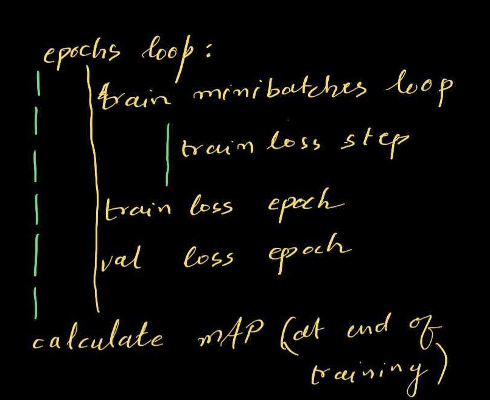

# prepare dataset files

```bash
python yolo/dataset/prepare_data.py 
```
after this files will be created at following locations:

```python
data/voc_test.txt
data/voc_train.txt
```
find the class with class names here:

```bash
data/sample/voc.names
```

# create the anchors according to dataset

```bash 
python dataset/create_anchor.py
```
following is output

```bash
load examples : 5011
Average IOU 0.6758329864286436
🟨       anchors are      [[39, 48], [58, 109], [139, 86], [99, 193], [209, 156], [158, 278], [381, 186], [264, 327], [424, 330]]
```
# start training


```python
python yolo/train.py

```

